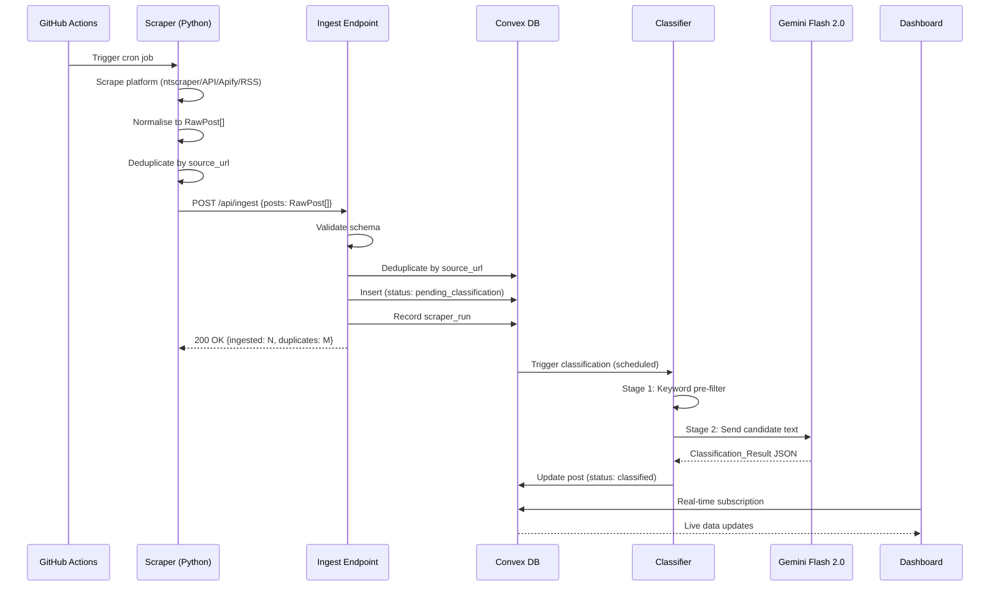
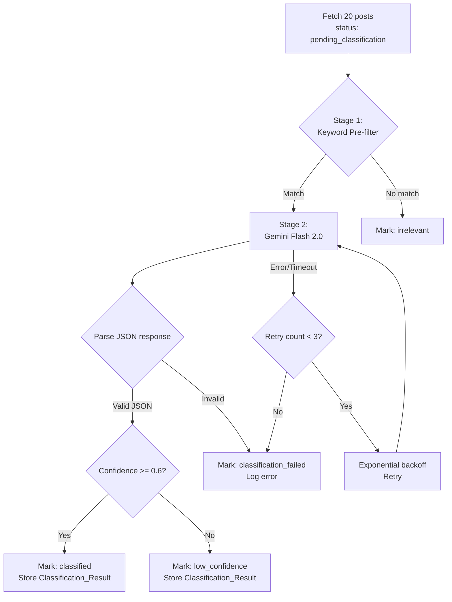

# Design Document: Sadhguru Intel Dashboard

## Overview

Sadhguru Intel is a threat intelligence platform that scrapes content from four platforms (X/Twitter, YouTube, Instagram/Facebook, News), classifies it through a two-stage AI pipeline (keyword pre-filter → Gemini Flash 2.0), stores results in Convex, and renders a public-facing React dashboard. The system runs autonomously on free-tier infrastructure with zero monthly cost.

The architecture follows a pipeline pattern: **Scrapers → Ingest Endpoint → Classification → Convex DB → React Dashboard**. Each stage is decoupled — scrapers run as GitHub Actions cron jobs, classification runs as Convex internal actions, and the dashboard reads via Convex real-time queries.

### Key Design Decisions

| Decision | Choice | Rationale |
|---|---|---|
| Charting library | Chart.js via UX4G's `ux4g-chart.js` | UX4G bundles Chart.js; avoids adding Recharts dependency |
| Network graph | Sigma.js | Better performance than D3 force-directed for 50+ nodes; built-in WebGL renderer |
| CSS strategy | UX4G 2.0.8 base + Tailwind CSS utilities | UX4G provides design system tokens (colors, typography, grid); Tailwind fills gaps with utility classes |
| Scraper runtime | Python 3.11 on GitHub Actions | Free CI minutes; ntscraper/feedparser/requests are Python-native |
| Backend | Convex (DB + serverless + real-time) | Free tier covers needs; real-time subscriptions eliminate polling |
| AI classification | Gemini Flash 2.0 | 1M tokens/day free tier; fast inference for classification tasks |
| Deployment | Vercel (frontend) + Convex (backend) | Both free tier; Vercel auto-deploys from Git |

## Architecture

### High-Level System Architecture

```mermaid
graph TB
    subgraph "GitHub Actions (Cron)"
        XS[X Scraper<br/>ntscraper<br/>2x daily]
        YS[YouTube Scraper<br/>Data API v3<br/>1x daily]
        IS[Instagram Scraper<br/>Apify<br/>every 3 days]
        NS[News Scraper<br/>NewsAPI + RSS<br/>3x daily]
    end

    subgraph "Convex Backend"
        IE[Ingest Endpoint<br/>HTTP Action<br/>POST /api/ingest]
        CL[Classifier<br/>Internal Action]
        DB[(Convex DB<br/>posts / scraper_runs / scraper_errors)]
        QF[Query Functions<br/>getDashboardStats<br/>getPostsByCategory<br/>getTopAccounts<br/>...]
        GM[Gemini Flash 2.0<br/>Stage 2 Classification]
    end

    subgraph "Vercel"
        FE[React + Vite Dashboard<br/>UX4G + Tailwind CSS<br/>Chart.js + Sigma.js]
    end

    XS -->|POST RawPost[]| IE
    YS -->|POST RawPost[]| IE
    IS -->|POST RawPost[]| IE
    NS -->|POST RawPost[]| IE

    IE -->|validate + dedup| DB
    IE -->|trigger| CL
    CL -->|keyword pre-filter| CL
    CL -->|candidates| GM
    GM -->|Classification_Result JSON| CL
    CL -->|store result| DB

    FE -->|real-time subscriptions| QF
    QF -->|read| DB
```

### Data Flow Sequence



## Components and Interfaces

### 1. Scrapers (Python 3.11)

Each scraper is a standalone Python script in `scrapers/` that:
1. Collects content from its platform using the platform-specific client
2. Normalises results into `RawPost` objects
3. Deduplicates within the batch by `source_url`
4. POSTs the batch to the Convex Ingest Endpoint

```
scrapers/
├── base_scraper.py       # Abstract base with normalise(), dedup(), post_batch()
├── x_scraper.py          # ntscraper-based, 500 posts/run
├── youtube_scraper.py    # YouTube Data API v3, 50 videos/run
├── instagram_scraper.py  # Apify Instagram Scraper, 60 posts/run
├── news_scraper.py       # NewsAPI + Google News RSS + supplementary RSS, 100 articles/run
└── requirements.txt
```

#### BaseScraper Interface

```python
class BaseScraper(ABC):
    def __init__(self, platform: str, convex_site_url: str):
        self.platform = platform
        self.convex_site_url = convex_site_url

    @abstractmethod
    def scrape(self) -> list[dict]:
        """Collect raw items from platform. Returns platform-specific dicts."""
        ...

    @abstractmethod
    def normalise(self, raw_item: dict) -> RawPost:
        """Convert platform-specific dict to RawPost."""
        ...

    def dedup_batch(self, posts: list[RawPost]) -> list[RawPost]:
        """Remove duplicates by source_url within batch."""
        seen = set()
        result = []
        for p in posts:
            if p.source_url not in seen:
                seen.add(p.source_url)
                result.append(p)
        return result

    def post_batch(self, posts: list[RawPost]) -> dict:
        """POST batch to Convex Ingest Endpoint."""
        resp = requests.post(
            f"{self.convex_site_url}/api/ingest",
            json={"posts": [p.to_dict() for p in posts]},
            headers={"Content-Type": "application/json"},
            timeout=30,
        )
        resp.raise_for_status()
        return resp.json()

    def run(self):
        """Full scrape pipeline: scrape → normalise → dedup → post."""
        raw_items = self.scrape()
        posts = [self.normalise(item) for item in raw_items]
        posts = self.dedup_batch(posts)
        return self.post_batch(posts)
```

### 2. GitHub Actions Scheduler

```
.github/workflows/
├── scrape-x.yml          # cron: "0 6,18 * * *"       (twice daily)
├── scrape-youtube.yml    # cron: "0 12 * * *"          (once daily)
├── scrape-instagram.yml  # cron: "0 9 */3 * *"         (every 3 days)
└── scrape-news.yml       # cron: "0 4,12,20 * * *"     (three times daily)
```

Each workflow:
1. Checks out the repo
2. Sets up Python 3.11
3. Installs `scrapers/requirements.txt`
4. Runs the scraper script with secrets injected as env vars
5. Logs output (success/failure captured by GitHub Actions)

### 3. Convex Backend

```
convex/
├── schema.ts             # Table definitions (posts, scraper_runs, scraper_errors)
├── http.ts               # HTTP action router (POST /api/ingest)
├── ingest.ts             # Ingest mutation + validation logic
├── classify.ts           # Classification internal action (Stage 1 + Stage 2)
├── queries/
│   ├── dashboard.ts      # getDashboardStats
│   ├── posts.ts          # getPostsByCategory (paginated)
│   ├── accounts.ts       # getTopAccounts
│   ├── timeline.ts       # getTimelineSeries
│   ├── themes.ts         # getThemeBreakdown
│   ├── platforms.ts      # getPlatformBreakdown
│   └── admin.ts          # getRecentScraperRuns, getScraperErrors, getClassificationStats
└── lib/
    ├── keywords.ts       # Stage 1 keyword lists and pre-filter logic
    ├── gemini.ts         # Gemini Flash 2.0 API client
    └── schemas.ts        # Zod-like validation schemas for RawPost, Classification_Result
```

#### Ingest Endpoint (HTTP Action)

```typescript
// convex/http.ts
import { httpRouter } from "convex/server";
import { ingestPosts } from "./ingest";

const http = httpRouter();

http.route({
  path: "/api/ingest",
  method: "POST",
  handler: ingestPosts,
});

export default http;
```

#### Query Functions Interface

| Function | Parameters | Returns |
|---|---|---|
| `getDashboardStats` | `{}` | `{ totalPosts, classifiedPosts, dateRange: {from, to} }` |
| `getPostsByCategory` | `{ category?, severity?, page, pageSize }` | `{ posts: Post[], totalCount, hasMore }` |
| `getTopAccounts` | `{ category?, limit }` | `{ accounts: AccountSummary[] }` |
| `getTimelineSeries` | `{ category?, granularity }` | `{ series: {date, count}[] }` |
| `getThemeBreakdown` | `{ category? }` | `{ themes: {theme, count}[] }` |
| `getPlatformBreakdown` | `{ category? }` | `{ platforms: {platform, count}[] }` |
| `getRecentScraperRuns` | `{ limit }` | `{ runs: ScraperRun[] }` |
| `getScraperErrors` | `{ limit }` | `{ errors: ScraperError[] }` |
| `getClassificationStats` | `{}` | `{ pending, classified, lowConfidence, failed }` |
| `getNetworkData` | `{ category? }` | `{ nodes: NetworkNode[], edges: NetworkEdge[] }` |

### 4. Classification Pipeline

The classifier runs as a Convex scheduled action, processing posts in batches of 20.



**Rate limiting**: The classifier respects Gemini's 15 req/min limit by spacing requests with a minimum 4-second delay between API calls. Batches of 20 posts are processed sequentially within a single scheduled action invocation.

### 5. React Dashboard (Frontend)

```
src/
├── main.tsx
├── App.tsx                    # Router setup
├── components/
│   ├── layout/
│   │   ├── Sidebar.tsx        # Navigation sidebar
│   │   ├── Header.tsx         # Top bar with track toggle
│   │   └── Layout.tsx         # Shell with sidebar + content area
│   ├── charts/
│   │   ├── TimelineChart.tsx  # Line chart (Chart.js) — post volume over time
│   │   ├── PlatformChart.tsx  # Doughnut chart — platform distribution
│   │   ├── SeverityChart.tsx  # Bar chart — severity distribution
│   │   └── ThemeChart.tsx     # Horizontal bar chart — theme breakdown
│   ├── panels/
│   │   ├── StatsHero.tsx      # Summary cards (total posts, classified, date range)
│   │   ├── TopPosts.tsx       # Table of recent/high-severity posts
│   │   ├── TopAccounts.tsx    # Ranked account list
│   │   └── ActivityFeed.tsx   # Real-time feed (Convex subscription)
│   ├── network/
│   │   └── NetworkGraph.tsx   # Sigma.js force-directed graph
│   └── shared/
│       ├── TrackToggle.tsx    # Hate/Misinfo track switcher
│       ├── Card.tsx           # UX4G card wrapper
│       └── Badge.tsx          # Severity/platform badge
├── pages/
│   ├── DashboardPage.tsx      # / route
│   ├── HateTrackPage.tsx      # /hate route
│   ├── MisinfoTrackPage.tsx   # /misinfo route
│   ├── AccountsPage.tsx       # /accounts route
│   ├── NetworkPage.tsx        # /network route
│   ├── AboutPage.tsx          # /about route
│   └── AdminPage.tsx          # /admin route
├── hooks/
│   ├── useTrackFilter.ts      # Track toggle state management
│   └── usePagination.ts       # Pagination state for post lists
└── lib/
    ├── chartConfig.ts         # Chart.js defaults (UX4G colors, Noto Sans font)
    └── convex.ts              # Convex client setup
```

### UX4G + Tailwind CSS Integration

The two styling systems serve complementary roles:

**UX4G 2.0.8** provides:
- CSS custom properties (color tokens: `--bs-primary`, `--bs-danger`, etc.)
- Noto Sans font family via `@font-face`
- Bootstrap-compatible grid system and reboot
- Component styles (cards, badges, tables, buttons)
- Chart.js bundle (`ux4g-chart.js`)

**Tailwind CSS** provides:
- Utility-first classes for layout, spacing, responsive design
- Dark mode support via `dark:` variant
- Custom configuration extending UX4G tokens

```javascript
// tailwind.config.js
export default {
  darkMode: 'class',
  content: ['./index.html', './src/**/*.{js,ts,jsx,tsx}'],
  theme: {
    extend: {
      fontFamily: {
        sans: ['"Noto Sans"', 'system-ui', 'sans-serif'],
      },
      colors: {
        primary: {
          DEFAULT: '#613AF5',
          50: '#F3EFFE', 100: '#E0D5FD', 200: '#C1ABFB',
          300: '#A281F9', 400: '#8357F7', 500: '#613AF5',
          600: '#4A2BC2', 700: '#392095', 800: '#281668', 900: '#170C3B',
        },
        danger: {
          DEFAULT: '#B7131A',
          500: '#B7131A',
        },
        warning: {
          DEFAULT: '#B77224',
          500: '#B77224',
        },
        success: {
          DEFAULT: '#3C9718',
          500: '#3C9718',
        },
        info: {
          DEFAULT: '#00AAFF',
          500: '#00AAFF',
        },
      },
    },
  },
  // Prevent Tailwind from conflicting with UX4G base styles
  corePlugins: {
    preflight: false, // UX4G's ux4g-reboot.css handles this
  },
}
```

**Loading order in `index.html`**:
1. UX4G CSS (`ux4g-min.css`) — base styles, grid, components
2. Tailwind CSS (generated) — utility overrides
3. UX4G Chart.js (`ux4g-chart.js`) — makes `Chart` available globally

**Chart.js configuration** uses UX4G color tokens:

```typescript
// src/lib/chartConfig.ts
import Chart from 'chart.js/auto';

Chart.defaults.font.family = '"Noto Sans", sans-serif';
Chart.defaults.color = '#C6C6C6'; // --bs-gray-200 for dark mode labels
Chart.defaults.borderColor = 'rgba(255,255,255,0.1)';

export const CHART_COLORS = {
  primary: '#613AF5',
  danger: '#B7131A',
  warning: '#B77224',
  success: '#3C9718',
  info: '#00AAFF',
  purple: '#6f42c1',
  pink: '#d63384',
  teal: '#20c997',
};

export const PLATFORM_COLORS: Record<string, string> = {
  twitter: '#00AAFF',
  youtube: '#B7131A',
  instagram: '#d63384',
  news: '#B77224',
};

export const SEVERITY_COLORS: Record<string, string> = {
  low: '#3C9718',
  medium: '#B77224',
  high: '#B7131A',
  critical: '#613AF5',
};
```

## Data Models

### Convex Schema

```typescript
// convex/schema.ts
import { defineSchema, defineTable } from "convex/server";
import { v } from "convex/values";

export default defineSchema({
  posts: defineTable({
    // Source data (from RawPost)
    source_url: v.string(),
    platform: v.union(
      v.literal("twitter"),
      v.literal("youtube"),
      v.literal("instagram"),
      v.literal("news")
    ),
    author: v.string(),
    author_id: v.optional(v.string()),
    content: v.string(),
    post_timestamp: v.number(), // Unix ms
    raw_metadata: v.optional(v.any()),

    // Classification result
    status: v.union(
      v.literal("pending_classification"),
      v.literal("classified"),
      v.literal("low_confidence"),
      v.literal("classification_failed"),
      v.literal("irrelevant")
    ),
    category: v.optional(v.union(v.literal("hate"), v.literal("misinfo"))),
    severity: v.optional(
      v.union(
        v.literal("low"),
        v.literal("medium"),
        v.literal("high"),
        v.literal("critical")
      )
    ),
    themes: v.optional(v.array(v.string())),
    confidence: v.optional(v.number()),
    reasoning: v.optional(v.string()),

    // Metadata
    ingested_at: v.number(), // Unix ms
    classified_at: v.optional(v.number()),
  })
    .index("by_source_url", ["source_url"])
    .index("by_status", ["status"])
    .index("by_category", ["category"])
    .index("by_platform", ["platform"])
    .index("by_category_severity", ["category", "severity"])
    .index("by_author", ["author"])
    .index("by_post_timestamp", ["post_timestamp"]),

  scraper_runs: defineTable({
    platform: v.string(),
    post_count: v.number(),
    duplicates_skipped: v.number(),
    status: v.union(v.literal("success"), v.literal("partial"), v.literal("failed")),
    started_at: v.number(),
    completed_at: v.number(),
    error_message: v.optional(v.string()),
  })
    .index("by_platform", ["platform"])
    .index("by_completed_at", ["completed_at"]),

  scraper_errors: defineTable({
    platform: v.string(),
    error_type: v.string(),
    error_message: v.string(),
    context: v.optional(v.any()),
    timestamp: v.number(),
  })
    .index("by_platform", ["platform"])
    .index("by_timestamp", ["timestamp"]),
});
```

### RawPost Schema (Python ↔ Convex)

```python
# scrapers/models.py
from dataclasses import dataclass, asdict
from typing import Optional, Any
import json

@dataclass
class RawPost:
    source_url: str
    platform: str        # "twitter" | "youtube" | "instagram" | "news"
    author: str
    content: str
    post_timestamp: int  # Unix ms
    author_id: Optional[str] = None
    raw_metadata: Optional[dict[str, Any]] = None

    def to_dict(self) -> dict:
        d = asdict(self)
        # Remove None values for clean JSON
        return {k: v for k, v in d.items() if v is not None}

    def to_json(self) -> str:
        return json.dumps(self.to_dict())

    @classmethod
    def from_dict(cls, data: dict) -> "RawPost":
        return cls(**{k: v for k, v in data.items() if k in cls.__dataclass_fields__})

    @classmethod
    def from_json(cls, json_str: str) -> "RawPost":
        return cls.from_dict(json.loads(json_str))
```

### Classification_Result Schema

```typescript
// convex/lib/schemas.ts
export interface ClassificationResult {
  category: "hate" | "misinfo";
  severity: "low" | "medium" | "high" | "critical";
  themes: string[];
  confidence: number; // 0.0 - 1.0
  reasoning: string;
}

export function serializeClassificationResult(result: ClassificationResult): string {
  return JSON.stringify(result);
}

export function deserializeClassificationResult(json: string): ClassificationResult {
  const parsed = JSON.parse(json);
  // Validate required fields
  if (!parsed.category || !parsed.severity || !parsed.themes || 
      parsed.confidence === undefined || !parsed.reasoning) {
    throw new Error("Invalid ClassificationResult: missing required fields");
  }
  if (!["hate", "misinfo"].includes(parsed.category)) {
    throw new Error(`Invalid category: ${parsed.category}`);
  }
  if (!["low", "medium", "high", "critical"].includes(parsed.severity)) {
    throw new Error(`Invalid severity: ${parsed.severity}`);
  }
  if (typeof parsed.confidence !== "number" || parsed.confidence < 0 || parsed.confidence > 1) {
    throw new Error(`Invalid confidence: ${parsed.confidence}`);
  }
  return parsed as ClassificationResult;
}
```

### Network Graph Data Model

```typescript
// For Sigma.js rendering
export interface NetworkNode {
  id: string;          // author name or ID
  label: string;       // display name
  platform: string;
  postCount: number;
  category: "hate" | "misinfo" | "both";
  size: number;        // derived from postCount
}

export interface NetworkEdge {
  id: string;
  source: string;      // node ID
  target: string;      // node ID
  weight: number;      // shared themes/timing correlation
  type: "shared_theme" | "co_amplification" | "temporal_cluster";
}
```


## Correctness Properties

*A property is a characteristic or behavior that should hold true across all valid executions of a system — essentially, a formal statement about what the system should do. Properties serve as the bridge between human-readable specifications and machine-verifiable correctness guarantees.*

### Property 1: RawPost Serialisation Round-Trip

*For any* valid RawPost object, serialising it to JSON via `to_json()` and then deserialising back via `from_json()` SHALL produce an equivalent RawPost object with identical field values.

**Validates: Requirements 9.1, 9.2, 9.3**

### Property 2: Classification_Result Serialisation Round-Trip

*For any* valid Classification_Result object (with category in {"hate", "misinfo"}, severity in {"low", "medium", "high", "critical"}, non-empty themes array, confidence in [0, 1], and non-empty reasoning string), serialising to JSON via `serializeClassificationResult()` and deserialising back via `deserializeClassificationResult()` SHALL produce an equivalent Classification_Result object.

**Validates: Requirements 8.1, 8.2, 8.3**

### Property 3: Scraper Normalisation Produces Valid RawPost

*For any* platform-specific raw item dict (from X, YouTube, Instagram, or News) containing the minimum required fields for that platform, the scraper's `normalise()` function SHALL produce a RawPost object with all required fields populated: non-empty `source_url`, valid `platform` string, non-empty `author`, non-empty `content`, and positive integer `post_timestamp`.

**Validates: Requirements 1.2, 2.2, 3.2, 4.2**

### Property 4: Batch Deduplication Preserves Uniqueness

*For any* list of RawPost objects (including lists with duplicate `source_url` values), `dedup_batch()` SHALL return a list where all `source_url` values are unique, the output length is less than or equal to the input length, and every item in the output exists in the input.

**Validates: Requirements 1.3, 2.3, 3.3, 4.3**

### Property 5: Ingest Validation Accepts Valid and Rejects Invalid

*For any* dict, the RawPost schema validation function SHALL accept it if and only if it contains all required fields (`source_url`, `platform`, `author`, `content`, `post_timestamp`) with correct types. Invalid dicts SHALL be rejected with an error.

**Validates: Requirements 5.2, 5.5**

### Property 6: Keyword Pre-Filter Consistency

*For any* text string containing at least one keyword from the predefined keyword list, the Stage 1 keyword pre-filter SHALL return `true`. *For any* text string containing no keywords from the list, the pre-filter SHALL return `false`.

**Validates: Requirements 6.1**

### Property 7: Confidence Threshold Determines Classification Status

*For any* Classification_Result with a confidence value, if confidence >= 0.6 then the post status SHALL be set to "classified", and if confidence < 0.6 then the post status SHALL be set to "low_confidence". The threshold boundary (exactly 0.6) SHALL result in "classified" status.

**Validates: Requirements 6.4, 6.5**

### Property 8: Classification_Result Structural Invariants

*For any* Classification_Result produced by the classifier, it SHALL satisfy all of: (a) `category` is exactly "hate" or "misinfo", (b) `severity` is exactly one of "low", "medium", "high", "critical", (c) `themes` is a non-empty array where every element belongs to the predefined theme taxonomy, (d) `confidence` is a number in [0, 1], and (e) `reasoning` is a non-empty string.

**Validates: Requirements 7.1, 7.2, 7.3, 7.4**

### Property 9: Track Filtering Returns Only Matching Category

*For any* list of classified posts and a selected category ("hate" or "misinfo"), filtering by that category SHALL return a list where every post has `category` equal to the selected value, and the count equals the number of posts with that category in the original list.

**Validates: Requirements 10.3, 11.1, 12.1**

### Property 10: Account Ranking Is Sorted Descending

*For any* list of accounts with associated flagged post counts, the ranking function SHALL return accounts sorted in non-increasing order of flagged post count, and the output SHALL contain the same accounts as the input.

**Validates: Requirements 13.1**

## Error Handling

### Scraper Error Handling

| Error Scenario | Handling Strategy |
|---|---|
| Platform API rate limit exceeded | Log error to stdout; GitHub Actions captures it. Scraper exits with non-zero code. Next cron run retries. |
| Platform API authentication failure | Log error with details. Scraper exits. Operator checks GitHub Actions logs. |
| Network timeout during scraping | Requests timeout set to 30s. Log error and continue with partial results if possible. |
| Malformed platform response | Skip individual item, log warning. Continue processing remaining items. |
| Ingest Endpoint unreachable | Log error. Scraper exits with non-zero code. Data is lost for this run (acceptable — next run will re-collect recent content). |
| Ingest Endpoint returns 4xx | Log validation errors. Indicates schema mismatch — requires code fix. |

### Classification Error Handling

| Error Scenario | Handling Strategy |
|---|---|
| Gemini API error/timeout | Exponential backoff retry: 2s, 4s, 8s. Max 3 attempts. |
| All retries exhausted | Mark post `classification_failed`. Log to `scraper_errors` table. |
| Gemini returns invalid JSON | Parse error caught. Mark post `classification_failed`. Log raw response. |
| Gemini returns unexpected schema | Validation rejects result. Mark post `classification_failed`. Log details. |
| Rate limit (15 req/min) | 4-second minimum delay between Gemini calls. Batch size of 20 ensures ~80s per batch. |
| Confidence below threshold | Mark post `low_confidence`. Store result for potential review. |

### Frontend Error Handling

| Error Scenario | Handling Strategy |
|---|---|
| Convex connection lost | Convex client auto-reconnects. UI shows stale data indicator. |
| Query returns empty data | Charts render empty state with "No data available" message. |
| Chart.js rendering error | Error boundary catches. Fallback to "Chart unavailable" placeholder. |
| Sigma.js graph fails to render | Error boundary catches. Fallback message displayed. |
| Route not found | React Router catch-all redirects to `/`. |

### Ingest Endpoint Error Handling

| Error Scenario | Handling Strategy |
|---|---|
| Invalid JSON body | Return 400 with error message. |
| Schema validation failure | Reject invalid items. Log to `scraper_errors`. Return 200 with partial success report `{ingested: N, rejected: M, errors: [...]}`. |
| Duplicate `source_url` | Skip silently. Count in `duplicates_skipped`. |
| Convex internal error | Return 500. Scraper logs the failure. |

## Testing Strategy

### Unit Tests (Vitest)

Unit tests cover specific examples, edge cases, and error conditions:

- **Scraper normalisation**: Example tests for each platform with real-world-like payloads
- **Schema validation**: Edge cases (missing fields, wrong types, empty strings, boundary values)
- **Keyword pre-filter**: Example tests with known keyword matches and non-matches
- **Confidence threshold**: Boundary tests at exactly 0.6, just below, just above
- **Chart configuration**: Verify UX4G color tokens are correctly mapped
- **Component rendering**: React Testing Library tests for each page/component

### Property-Based Tests (fast-check)

Property-based tests verify universal properties across generated inputs. The project uses [fast-check](https://github.com/dubzzz/fast-check) for TypeScript and [Hypothesis](https://hypothesis.readthedocs.io/) for Python.

**Configuration**:
- Minimum 100 iterations per property test
- Each test tagged with: `Feature: sadhguru-intel-dashboard, Property {N}: {title}`

**Python (Hypothesis) — Scraper tests**:
- Property 1: RawPost round-trip (`to_json` → `from_json`)
- Property 3: Normalisation produces valid RawPost (per-platform generators)
- Property 4: Batch deduplication uniqueness

**TypeScript (fast-check) — Convex/Frontend tests**:
- Property 2: Classification_Result round-trip (`serialize` → `deserialize`)
- Property 5: Ingest validation (valid/invalid dict generator)
- Property 6: Keyword pre-filter consistency
- Property 7: Confidence threshold status assignment
- Property 8: Classification_Result structural invariants
- Property 9: Track filtering correctness
- Property 10: Account ranking sort order

### Integration Tests

- Ingest Endpoint: POST valid/invalid payloads to Convex dev instance
- Classification pipeline: End-to-end with mock Gemini responses
- Convex queries: Verify each query function returns correct shape with seeded data

### Smoke Tests

- GitHub Actions workflow YAML: Verify cron expressions are valid
- Environment variables: Verify required vars are read (not committed to repo)
- Dashboard routes: Verify all 7 routes render without errors
- Dark mode: Verify `dark` class is applied by default
